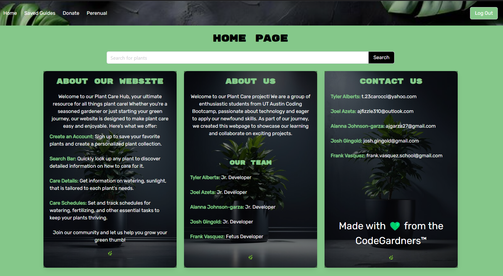
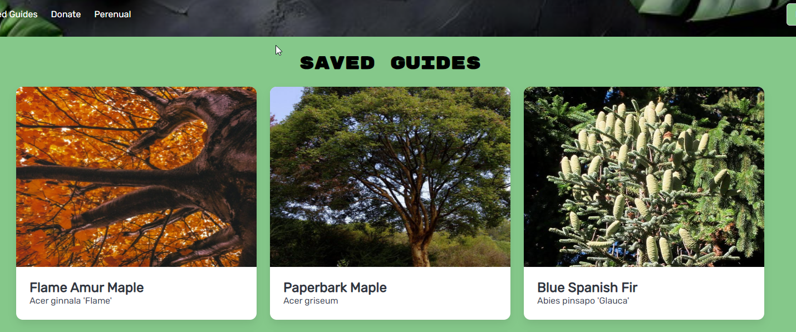
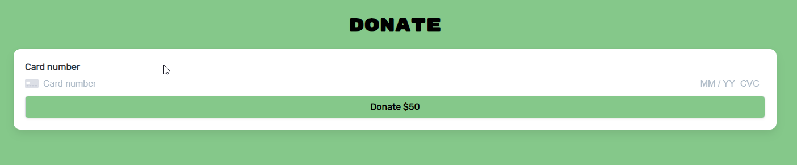

# Plant Care Website

## Table of Contents

- [Description](#description)
- [Usage](#usage)
- [Features](#features)
- [Technologies](#technologies)
- [Screenshots](#Screenshots)
- [Contact](#contact)

## Description

The Plant Care website is a MERN (MongoDB, Express.js, React.js, Node.js) SPA (Single Page Application) designed to help users manage their plants. Users can create and log in to their accounts, find and save plants, and track schedules for caring for their plants.

## Usage

1. Visit the website.
2. Create an account or log in with existing credentials.
3. Search for plants and view their details.
4. Save plants to your profile.
5. Track your plant care schedule.

## Features

- User authentication and authorization
- Search and view plant details
- Save favorite plants
- Track plant care schedules
- Stripe integration for donations

## Technologies

- Frontend: React.js, Apollo Client, GraphQL
- Backend: Node.js, Express.js, MongoDB, Mongoose, GraphQL
- Styling: CSS
- Authentication: JWT
- Payment: Stripe

## Screenshots

### Homepage

### SaveGuides

### Donate

## Contact Us

Tyler Alberts: t.23carocci@yahoo.com
Joel Azeta: ajfizzle310@outlook.com
Alanna Johnson-garza: ajgarza27@gmail.com
Josh Gingold: josh.gingold@gmail.com
Frank Vasquez: frank.vasquez.school@gmail.com
